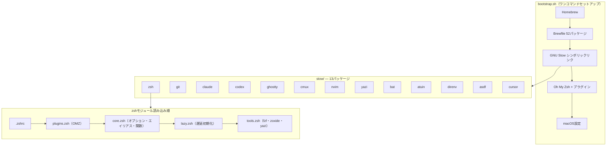

# dotfiles

[](https://github.com/otake-shol/dotfiles/actions/workflows/ci.yml)

macOS向けの個人開発環境設定ファイル。GNU Stowによるモジュール管理、ワンコマンドセットアップ、全ツールTokyoNight統一。

## 前提条件

- macOS（Apple Silicon / Intel）
- Xcode Command Line Tools（`xcode-select --install`）

## クイックスタート

```bash
git clone https://github.com/otake-shol/dotfiles.git ~/dotfiles
cd ~/dotfiles && bash bootstrap.sh
```

### bootstrapオプション

```bash
bash bootstrap.sh              # 通常実行
bash bootstrap.sh -n           # ドライラン（変更なし）
bash bootstrap.sh -y           # 完全自動（対話なし）
bash bootstrap.sh -n -v        # ドライラン + 詳細出力
bash bootstrap.sh --skip-apps  # アプリインストールをスキップ
```

`bootstrap.sh` は Homebrew と Oh My Zsh の公式インストーラだけを明示例外として直接実行する。任意の remote script はパイプ実行しない。

## ディレクトリ構造

```
dotfiles/
├── stow/                  # GNU Stowパッケージ（13個）
│   ├── asdf/
│   ├── atuin/
│   ├── bat/
│   ├── claude/
│   ├── codex/
│   ├── cmux/
│   ├── cursor/
│   ├── direnv/
│   ├── ghostty/
│   ├── git/
│   ├── nvim/
│   ├── yazi/
│   └── zsh/
├── templates/             # ローカル設定テンプレート
├── bootstrap.sh           # ワンコマンドセットアップ
├── Brewfile               # Homebrewパッケージ定義
└── Makefile               # Stow操作・lint・クリーンアップ
```

## アーキテクチャ



## Stowパッケージ一覧

| パッケージ | 説明 | 主要ファイル |
|-----------|------|-------------|
| **zsh** | シェル設定（モジュール分割・遅延読み込み・56エイリアス・OMZ 6プラグイン） | `.zshrc`, `.zsh/{core,plugins,lazy,tools}.zsh` |
| **git** | Git設定（28エイリアス・delta・git-secrets 8パターン） | `.gitconfig`, `.gitignore_global`, `.commit-template.txt`, `.editorconfig` |
| **claude** | Claude Code（3 hookスクリプト・8コマンド・権限制御） | `.claude/settings.json`, `hooks/`, `commands/` |
| **codex** | Codex CLI（config・AGENTS・hook・MCP） | `.codex/config.toml`, `.codex/AGENTS.md`, `.codex/hooks/` |
| **ghostty** | GPUターミナル（TokyoNight・透過80%・JetBrains Mono） | `.config/ghostty/config` |
| **cmux** | ワークスペース管理（5プリセット・色分け） | `.config/cmux/cmux.json` |
| **nvim** | 軽量エディタ（プラグインなし・git commit用） | `.config/nvim/init.lua` |
| **yazi** | TUIファイラー（Sixelプレビュー・3 Luaプラグイン） | `.config/yazi/yazi.toml` |
| **bat** | cat代替（シンタックスハイライト・行番号） | `.config/bat/config` |
| **atuin** | SQLite履歴検索（ファジー・シークレットフィルタ） | `.config/atuin/config.toml` |
| **direnv** | ディレクトリ別環境変数（.env自動読み込み） | `.config/direnv/direnv.toml` |
| **asdf** | バージョン管理（Java/Node/Python/Terraform固定） | `.tool-versions` |
| **cursor** | Cursor拡張リスト管理 | `.config/cursor/extensions.txt` |

## シェル起動パフォーマンス

Powerlevel10kの**Instant Prompt**により、体感起動は瞬時。重いツール（asdf/atuin/direnv）は遅延読み込みで初回呼び出しまでコスト0。

計測: `zprof` で確認可能（`.zshrc` 先頭の `zmodload zsh/zprof` を有効化）。

## コマンド

```bash
make install           # 全Stowパッケージをインストール
make install-zsh       # 個別インストール
make uninstall         # 全パッケージをアンインストール
make check             # Stowドライラン（競合検出）
make check-strict      # Stowドライラン（差分・競合で失敗）
make doctor            # Stow同期・壊れたリンク検出
make doctor-plan       # 修復候補を表示（変更なし）
make lint              # ShellCheck
make clean             # バックアップファイル・.DS_Store削除
make packages          # パッケージ一覧表示
make stats             # Stow/Brewfile件数を表示
make readme-check      # README内の件数が実体と一致するか確認
make runtimes-install  # asdf plugin/runtime を .tool-versions から導入
make versions-audit    # .tool-versions の固定バージョン確認
```

`make runtimes-install` は `stow/asdf/.tool-versions` を読み、未追加の asdf plugin を追加してから `asdf install` を実行する。Java/Node/Python/Terraform は時間とネットワーク依存が大きいため、bootstrap では自動実行せず必要な時だけ実行する。

## Brewfileの範囲

`Brewfile` は新しいMacを普段使いできる状態に近づけるため、CLIだけでなくGUIアプリも含める。`Core CLI Tools` と `Core GUI Applications` は常用前提、`Optional CLI Tools` と `Optional GUI Applications` は作業内容に応じた追加ツールとして扱う。

OpenAI CodexはHomebrewの `cask "codex"` がCLIを提供する。Codex DesktopはHomebrew caskとは別物のため、`bootstrap.sh` が公式DMGをApple Silicon / Intelに応じて導入する。

軽量セットアップにしたい場合は `bash bootstrap.sh --skip-apps` でアプリ導入を飛ばし、必要なStowリンクだけを `make install-PKG` で入れる。

## CI

GitHub Actionsで以下を自動検証:
- ShellCheck（bootstrap.sh + Claude hooks）
- Stow競合検出（全パッケージのドライラン）
- Zsh構文チェック
- Brewfile構文検証

## キーバインド

| キー | 機能 |
|------|------|
| Ctrl+T | fzfファイル検索 |
| Alt+C | fzfディレクトリ移動 |
| Ctrl+R | atuin履歴検索 |
| Ctrl+Z | fg/bg トグル |

## Claude Code

```bash
c / co / cs / ch       # 起動（デフォルト/Opus/Sonnet/Haiku）
cdef / cauto / cplan   # 権限モード切替（通常/自動/計画）
cyolo                  # 権限確認スキップ（要注意）
cc                     # 最新セッション続行
cls                    # セッション一覧
```

カスタムコマンド: `/verify`, `/commit-push`, `/spec`, `/review`, `/test`, `/worktree`, `/slides`, `/pc-checkup`

## Codex

```bash
codex                  # 対話セッション開始
codex -p fast          # 軽量プロファイル
codex -p deep          # 高推論プロファイル
codex review           # 非対話コードレビュー
cxcp                   # 変更確認→検証→commit→push をCodexに依頼
codex-commit-push "feat: ..."  # deterministicなcommit+push
codex-commit-push "fix: ..." README.md Makefile  # 指定ファイルだけcommit+push
~/.codex/hooks/verify.sh .  # 手動検証
```

設定: `stow/codex/.codex/config.toml`、グローバル指示: `stow/codex/.codex/AGENTS.md`

### Codex MCP: App Store Connect Review

`app-store-connect-review` MCPは、App Store Connect APIでApp Review用の連絡先・デモアカウント・審査メモ・添付ファイルを扱う。

秘密情報はdotfilesへ保存しない。`~/.zshrc.local` などGit管理外のローカル設定で次を渡す:

```bash
export ASC_KID="YOUR_KEY_ID"
export ASC_ISSUER_ID="YOUR_ISSUER_ID"
export ASC_P8_PATH="$HOME/.appstoreconnect/private_keys/AuthKey_YOUR_KEY_ID.p8"
```

利用できる主なツール:

- `asc_list_apps`
- `asc_list_app_store_versions`
- `asc_get_app_store_review_detail`
- `asc_create_app_store_review_detail`
- `asc_update_app_store_review_detail`
- `asc_create_app_store_review_attachment`

## セキュリティ

- **git-secrets**: AWS/Slack/GitHub/OpenAI/Anthropic等 8パターン検出（`.gitconfig`で定義、Stow管理）
- **Claude Code権限**: 自動実行寄りの許可 + deny（.env/SSH鍵/rm -rf/sudo/再帰的chmod・chown）、ask（force push/curl/brew uninstall/stow -D 等）でゲート
- **Codex権限**: workspace-write + on-request。`.env`/credentials/SSH鍵/破壊的操作は `AGENTS.md` で明示的に禁止・確認。
- **Remote script**: Homebrew と Oh My Zsh の公式インストーラだけを bootstrap の明示例外にする。それ以外の導入は手順確認後に実行する。

## テーマ

全ツールで **TokyoNight Night** に統一:

| ツール | 設定ファイル |
|--------|-------------|
| Ghostty | `stow/ghostty/.config/ghostty/config` |
| bat | `stow/bat/.config/bat/config` |
| fzf | `stow/zsh/.zsh/tools.zsh` |
| yazi | `stow/yazi/.config/yazi/theme.toml` |
| Neovim | `stow/nvim/.config/nvim/init.lua` |
| git-delta | `stow/git/.gitconfig` |

## カスタマイズ

bootstrap.shが初回実行時に以下のローカル設定ファイルを`templates/`から生成する。Git管理外でマシン固有の設定を保持する。

| ファイル | 用途 |
|---------|------|
| `~/.gitconfig.local` | Gitユーザー名・メール・GPG署名 |
| `~/.zshrc.local` | APIキー・MCPトークン・組織固有設定 |

## トラブルシューティング

### コマンドが見つからない

```bash
functions claude           # 関数定義を確認
source ~/.zsh/lazy.zsh     # 手動読み込み
```

`ZSH_CONFIG_DIR`がunsetされていないか確認。

### シンボリックリンクの修復

```bash
cd ~/dotfiles && stow --restow --target=$HOME --dir=stow zsh
```

### Apple Watch sudo認証が効かない（macOSアップデート後）

```bash
cat /etc/pam.d/sudo_local   # 設定確認
bash bootstrap.sh            # 再セットアップ
```

## 関連リポジトリ

- [otake-shol/obsidian](https://github.com/otake-shol/obsidian) — Obsidian Vault本体。dotfilesはアプリのインストール（Brewfile）のみ担当し、Vault内容と`.obsidian/`設定はそちらで管理。
