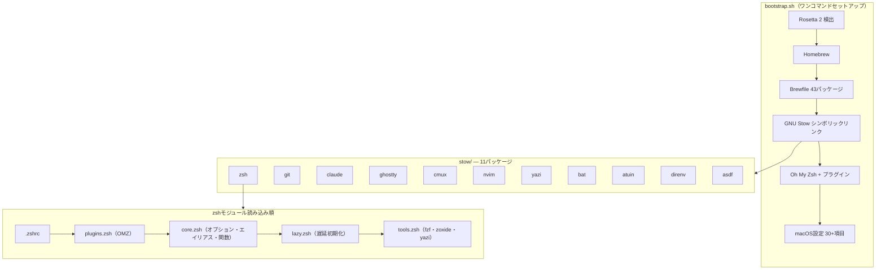

# dotfiles

macOS向けの個人開発環境設定ファイル。GNU Stowによるモジュール管理、ワンコマンドセットアップ、全ツールTokyoNight統一。

## クイックスタート

```bash
git clone https://github.com/otake-shol/dotfiles.git ~/dotfiles
cd ~/dotfiles && bash bootstrap.sh
```

### bootstrapオプション

```bash
bash bootstrap.sh              # 通常実行
bash bootstrap.sh -n           # ドライラン（変更なし）
bash bootstrap.sh -y           # 完全自動（対話なし）
bash bootstrap.sh -n -v        # ドライラン + 詳細出力
bash bootstrap.sh --skip-apps  # アプリインストールをスキップ
```

## ディレクトリ構造

```
dotfiles/
├── stow/                  # GNU Stowパッケージ（11個）
│   ├── asdf/              #   バージョン管理（Node/Python/Terraform）
│   ├── atuin/             #   SQLite履歴検索
│   ├── bat/               #   cat代替
│   ├── claude/            #   Claude Code設定・hooks・コマンド
│   ├── cmux/              #   ワークスペース管理
│   ├── direnv/            #   ディレクトリ別環境変数
│   ├── ghostty/           #   GPUターミナル
│   ├── git/               #   Git設定・secrets・テンプレート
│   ├── nvim/              #   軽量エディタ
│   ├── yazi/              #   TUIファイラー
│   └── zsh/               #   シェル設定（モジュール分割）
├── bootstrap.sh           # ワンコマンドセットアップ
├── Brewfile               # Homebrewパッケージ定義
└── Makefile               # Stow操作・lint・クリーンアップ
```

## アーキテクチャ



## Stowパッケージ一覧

| パッケージ | 説明 | 主要ファイル |
|-----------|------|-------------|
| **zsh** | シェル設定（モジュール分割・遅延読み込み・55エイリアス） | `.zshrc`, `.zsh/{core,plugins,lazy,tools}.zsh` |
| **git** | Git設定（28エイリアス・delta・git-secrets 40+パターン） | `.gitconfig`, `.gitignore_global`, `.commit-template.txt` |
| **claude** | Claude Code（5 hooks・8コマンド・6 MCP・権限制御） | `.claude/settings.json`, `hooks/`, `commands/` |
| **ghostty** | GPUターミナル（TokyoNight・透過80%・JetBrains Mono） | `.config/ghostty/config` |
| **cmux** | ワークスペース管理（5プリセット・色分け） | `.config/cmux/cmux.json` |
| **nvim** | 軽量エディタ（プラグインなし・git commit用） | `.config/nvim/init.lua` |
| **yazi** | TUIファイラー（Sixelプレビュー・4 Luaプラグイン） | `.config/yazi/yazi.toml` |
| **bat** | cat代替（シンタックスハイライト・行番号） | `.config/bat/config` |
| **atuin** | SQLite履歴検索（ファジー・シークレットフィルタ） | `.config/atuin/config.toml` |
| **direnv** | ディレクトリ別環境変数（.env自動読み込み） | `.config/direnv/direnv.toml` |
| **asdf** | バージョン管理（Node/Python/Terraform固定） | `.tool-versions` |

## シェル起動パフォーマンス

Powerlevel10kの**Instant Prompt**により、体感起動は瞬時。重いツール（asdf/atuin/direnv）は遅延読み込みで初回呼び出しまでコスト0。

計測: `zprof` で確認可能（`.zshrc` 先頭の `zmodload zsh/zprof` を有効化）。

## コマンド

```bash
make install           # 全Stowパッケージをインストール
make install-zsh       # 個別インストール
make uninstall         # 全パッケージをアンインストール
make check             # Stowドライラン（競合検出）
make lint              # ShellCheck
make clean             # バックアップファイル・.DS_Store削除
make packages          # パッケージ一覧表示
```

## キーバインド

| キー | 機能 |
|------|------|
| Ctrl+T | fzfファイル検索 |
| Alt+C | fzfディレクトリ移動 |
| Ctrl+R | atuin履歴検索 |
| Ctrl+Z | fg/bg トグル |

## Claude Code

```bash
c / co / cs / ch       # 起動（デフォルト/Opus/Sonnet/Haiku）
cc                     # 最新セッション続行
cls                    # セッション一覧
```

カスタムコマンド: `/verify`, `/commit-push`, `/spec`, `/review`, `/test`, `/worktree`, `/slides`, `/pc-checkup`

## セキュリティ

- **git-secrets**: AWS/Slack/GitHub/OpenAI/Anthropic等 40+パターン検出
- **1Password CLI**: シークレット管理統合
- **pam-watchid**: Apple Watch sudo認証
- **Claude Code権限**: deny（.env/SSH鍵/rm -rf）、ask（git push/curl）の三層制御

## テーマ

全ツールで **TokyoNight Night** に統一:

| ツール | 設定ファイル |
|--------|-------------|
| Ghostty | `stow/ghostty/.config/ghostty/config` |
| bat | `stow/bat/.config/bat/config` |
| fzf | `stow/zsh/.zsh/tools.zsh` |
| yazi | `stow/yazi/.config/yazi/theme.toml` |
| Neovim | `stow/nvim/.config/nvim/init.lua` |
| git-delta | `stow/git/.gitconfig` |

## トラブルシューティング

### コマンドが見つからない

```bash
functions claude           # 関数定義を確認
source ~/.zsh/lazy.zsh     # 手動読み込み
```

`ZSH_CONFIG_DIR`がunsetされていないか確認。

### シンボリックリンクの修復

```bash
cd ~/dotfiles && stow --restow --target=$HOME --dir=stow zsh
```

### Apple Watch sudo認証が効かない（macOSアップデート後）

```bash
cat /etc/pam.d/sudo_local   # 設定確認
bash bootstrap.sh            # 再セットアップ
```
