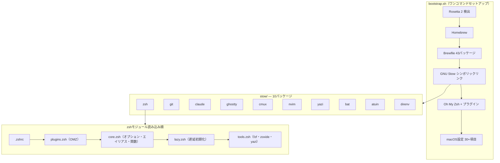

# dotfiles

macOS向けの個人開発環境設定ファイル。GNU Stowによるモジュール管理、ワンコマンドセットアップ、全ツールTokyoNight統一。

## クイックスタート

```bash
git clone https://github.com/otake-shol/dotfiles.git ~/dotfiles
cd ~/dotfiles && bash bootstrap.sh
```

## アーキテクチャ



## Stowパッケージ一覧

| パッケージ | 説明 | 主要ファイル |
|-----------|------|-------------|
| **zsh** | シェル設定（モジュール分割・遅延読み込み・89エイリアス） | `.zshrc`, `.zsh/{core,plugins,lazy,tools}.zsh` |
| **git** | Git設定（41エイリアス・delta・git-secrets 40+パターン） | `.gitconfig`, `.gitignore_global`, `commit-template.txt` |
| **claude** | Claude Code（5 hooks・8コマンド・6 MCP・権限制御） | `.claude/settings.json`, `hooks/`, `commands/` |
| **ghostty** | GPUターミナル（TokyoNight・透過80%・JetBrains Mono） | `.config/ghostty/config` |
| **cmux** | ワークスペース管理（7プリセット・色分け） | `.config/cmux/cmux.json` |
| **nvim** | 軽量エディタ（プラグインなし・git commit用） | `.config/nvim/init.lua` |
| **yazi** | TUIファイラー（Sixelプレビュー・4 Luaプラグイン） | `.config/yazi/yazi.toml` |
| **bat** | cat代替（シンタックスハイライト・行番号） | `.config/bat/config` |
| **atuin** | SQLite履歴検索（ファジー・シークレットフィルタ） | `.config/atuin/config.toml` |
| **direnv** | ディレクトリ別環境変数（.env自動読み込み） | `.config/direnv/direnv.toml` |

## シェル起動パフォーマンス

```
zprof 主要コスト（合計 ~325ms）:
  _omz_source       70ms  (Oh My Zsh)
  powerlevel10k      53ms  (プロンプト初期化)
  compinit           54ms  (補完システム)
  compaudit          44ms  (セキュリティ監査)
  _cache_valid       65ms  (キャッシュTTL確認)
  fzf_setup          23ms  (fzf初期化)
```

> Powerlevel10kの**Instant Prompt**により、体感起動は瞬時。asdf/atuin/direnvは遅延読み込みで初回呼び出しまでコスト0。

## Brewfileパッケージ（43個）

| カテゴリ | 数 | 内容 |
|---------|:---:|------|
| Git | 4 | git, gh, git-secrets, git-delta |
| バージョン管理・エディタ | 2 | asdf, neovim |
| シェル・ターミナル | 5 | atuin, fzf, zoxide, direnv, yazi |
| モダンCLI | 13 | bat, eza, fd, ripgrep, stow, btop, glow, tldr, trash, curl, jq, sd, tree |
| 開発ツール | 2 | shellcheck, marp-cli |
| GUI - ターミナル | 2 | ghostty, cmux |
| GUI - ユーティリティ | 7 | 1password, tailscale, alt-tab, cleanshot, ice, raycast |
| GUI - 生産性 | 4 | arc, spark, ticktick, slack |
| GUI - 開発 | 3 | figma, claude, orbstack |
| フォント | 1 | JetBrains Mono Nerd Font |

## モダンCLI

| 従来 | 代替 | 説明 |
|------|------|------|
| cat | bat | ハイライト付き表示 |
| ls | eza | アイコン+Git状態 |
| grep | ripgrep | 高速検索 |
| find | fd | 高速ファイル検索 |
| cd | zoxide | 学習型ジャンプ |
| history | atuin | SQLite履歴 |
| top | btop | GPU監視+マウス |
| sed | sd | 直感的な構文 |
| rm | trash | ゴミ箱へ移動 |

## コマンド

```bash
make install           # 全Stowパッケージをインストール
make install-zsh       # 個別インストール
make uninstall         # 全パッケージをアンインストール
make check             # Stowドライラン（競合検出）
make lint              # ShellCheck
make clean             # バックアップファイル削除
make packages          # パッケージ一覧表示
```

## キーバインド

| キー | 機能 |
|------|------|
| Ctrl+T | fzfファイル検索 |
| Alt+C | fzfディレクトリ移動 |
| Ctrl+R | atuin履歴検索 |
| Ctrl+Z | fg/bg トグル |

## Claude Code

```bash
c / co / cs / ch       # 起動（デフォルト/Opus/Sonnet/Haiku）
cc                     # 最新セッション続行
cls                    # セッション一覧
```

カスタムコマンド: `/verify`, `/commit-push`, `/spec`, `/review`, `/test`, `/worktree`, `/slides`, `/pc-checkup`

## セキュリティ

- **git-secrets**: AWS/Slack/GitHub/OpenAI/Anthropic等 40+パターン検出
- **1Password CLI**: シークレット管理統合
- **pam-watchid**: Apple Watch sudo認証
- **Claude Code権限**: deny（.env/SSH鍵/rm -rf）、ask（git push/curl）の三層制御

## テーマ

全ツールで **TokyoNight Night** に統一:
Ghostty / bat / fzf / yazi / Neovim / git-delta

## トラブルシューティング

### コマンドが見つからない

```bash
functions claude           # 関数定義を確認
source ~/.zsh/lazy.zsh     # 手動読み込み
```

`ZSH_CONFIG_DIR`がunsetされていないか確認。

### シンボリックリンクの修復

```bash
cd ~/dotfiles && stow --restow --target=$HOME --dir=stow zsh
```

### Apple Watch sudo認証が効かない（macOSアップデート後）

```bash
cat /etc/pam.d/sudo_local   # 設定確認
bash bootstrap.sh            # 再セットアップ
```
