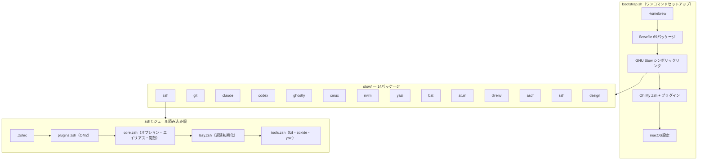

# dotfiles

[](https://github.com/otake-shol/dotfiles/actions/workflows/ci.yml)

Orcaを主要エディタ・IDEとするmacOS向けの個人開発環境設定ファイル。GNU Stowによるモジュール管理とワンコマンドセットアップに対応。

## 開発ツールの役割

| ツール | 用途 |
| --- | --- |
| **Orca** | 日常の開発、worktree管理、AIエージェント実行、内蔵ターミナル・ブラウザ |
| **Neovim** | ターミナル内の軽微な編集、Gitのメッセージ入力（`EDITOR`・`VISUAL`・`GIT_EDITOR`） |
| **Cursor / Zed** | 補助的な編集、コード閲覧・レビュー |
| **Ghostty / cmux** | 独立したターミナル作業 |

## 前提条件

- macOS（Apple Silicon / Intel）
- Xcode Command Line Tools（`xcode-select --install`）

## クイックスタート

```bash
git clone https://github.com/otake-shol/dotfiles.git ~/dotfiles
cd ~/dotfiles && bash bootstrap.sh
```

### bootstrapオプション

```bash
bash bootstrap.sh              # 通常実行
bash bootstrap.sh -n           # ドライラン（変更なし）
bash bootstrap.sh -y           # 完全自動（対話なし）
bash bootstrap.sh -n -v        # ドライラン + 詳細出力
bash bootstrap.sh --skip-apps  # Brewfile全体をスキップ（stowのみ確保）
bash bootstrap.sh --skip-gui-apps  # --skip-apps の別名
bash bootstrap.sh --cli-only   # Brewfile から GUI cask を除外（CLIのみ導入）
bash bootstrap.sh --no-codex-desktop    # Codex Desktop DMG をインストールしない
bash bootstrap.sh -y --with-codex-desktop  # -y でも Codex Desktop を明示導入
bash bootstrap.sh --adopt-conflicts  # Stow競合ファイルの取り込みを明示許可
```

`bootstrap.sh` は Homebrew と Oh My Zsh の公式インストーラだけを明示例外として直接実行する。任意の remote script はパイプ実行しない。
Stow競合はデフォルトで失敗終了する。既存ファイルをリポジトリへ取り込む必要がある場合だけ、内容を確認して `--adopt-conflicts` を指定する。

### 新PC移行チェックリスト

`make new-mac` で同等の手順をいつでも表示できる。

#### 自動（dotfiles で完結）

```bash
xcode-select --install
git clone https://github.com/otake-shol/dotfiles.git ~/dotfiles
cd ~/dotfiles
bash bootstrap.sh -y
make doctor
make validate              # リポジトリ整合性（絶対パス・local state・TOML/JSON 等）
make setup-fastlane-env    # App Store Connect / fastlane を使う場合
make runtimes-install      # Java/Node/Python/Terraform が必要になった時点で実行
```

#### 手動（dotfiles外）

- App Store で **Xcode** をインストール（fastlane / iOS開発で必須）
- **1Password** ログイン → SSH鍵 / GPG鍵 / `.p8` を `~/.ssh`, `~/.gnupg`, `~/.appstoreconnect/` に配置
- `gh auth login`
- `claude login`
- `codex login`
- **Orca** を起動し、利用するリポジトリとAIエージェントを設定（[導入・確認手順](#orcaの導入確認)）
- `p10k configure`（プロンプト初期化）
- **Chrome 縦タブ**: `chrome://flags` → "vertical" 検索 → Vertical Tabs を **Enabled** → 再起動（flagsはGoogle同期対象外のため手動設定が必要）

#### 移行直後の確認

- 旧PCで事前に `make snapshot` → `.snapshot/<ts>/` を新PCへコピー
- 新PCで `make snapshot` → 旧PCの `.snapshot/` と `diff` して欠落確認

`~/.gitconfig.local`, `~/.zshrc.local`, `~/.config/fastlane/env`, App Store Connect の `.p8` など、個人情報・秘密情報はdotfilesへ入れず、1PasswordやiCloud Drive等から復元する。

Claudeの個人設定は `~/.config/dotfiles-local/claude/` に保存する（`XDG_CONFIG_HOME`指定時はその配下）。`make setup-claude-local` でプロフィールと個人向けの記録スキルを既存内容のまま移し、`stow/claude/.claude/profile.local.md` と `skills/fact` にGit管理外のsymlinkを作成する。プロフィールを `CLAUDE.md` から参照し、スキルの利用方法も維持する。新PCでは外部の非公開設定を復元して `make setup-claude-local install-claude setup-privacy-hook` を実行する。移行元と移行先の両方にファイルがある場合は上書きせず停止する。

## ディレクトリ構造

```
dotfiles/
├── stow/                  # GNU Stowパッケージ（15個）
│   ├── asdf/
│   ├── atuin/
│   ├── bat/
│   ├── claude/
│   ├── codex/
│   ├── cmux/
│   ├── design/
│   ├── direnv/
│   ├── ghostty/
│   ├── git/
│   ├── nvim/
│   ├── ssh/
│   ├── yazi/
│   └── zsh/
├── orca/automations/      # Orca Automationsの定義（local/は個人用・Git管理外）
├── templates/             # ローカル設定テンプレート
├── bootstrap.sh           # ワンコマンドセットアップ
├── Brewfile               # Homebrewパッケージ定義
└── Makefile               # Stow操作・lint・クリーンアップ
```

## アーキテクチャ


```mermaid
graph TB
    subgraph bootstrap["bootstrap.sh（ワンコマンドセットアップ）"]
        B1[Homebrew]
        B1 --> B2[Brewfile 69パッケージ]
        B2 --> B3[GNU Stow シンボリックリンク]
        B3 --> B4[Oh My Zsh + プラグイン]
        B4 --> B5[macOS設定]
    end

    subgraph stow["stow/ — 14パッケージ"]
        S1[zsh]
        S2[git]
        S3[claude]
        S4[codex]
        S5[ghostty]
        S6[cmux]
        S7[nvim]
        S8[yazi]
        S9[bat]
        S10[atuin]
        S11[direnv]
        S12[asdf]
        S13[ssh]
        S14[design]
    end

    subgraph shell["zshモジュール読み込み順"]
        Z1[".zshrc"] --> Z2["plugins.zsh（OMZ）"]
        Z2 --> Z3["core.zsh（オプション・エイリアス・関数）"]
        Z3 --> Z4["lazy.zsh（遅延初期化）"]
        Z4 --> Z5["tools.zsh（fzf・zoxide・yazi）"]
    end

    B3 --> stow
    S1 --> shell
```

## Stowパッケージ一覧

| パッケージ | 説明 | 主要ファイル |
|-----------|------|-------------|
| **zsh** | シェル設定（モジュール分割・遅延読み込み・67エイリアス・OMZ 6プラグイン） | `.zshrc`, `.zsh/{core,plugins,lazy,tools}.zsh` |
| **git** | Git設定（28エイリアス・delta・git-secrets 8パターン） | `.gitconfig`, `.gitignore_global`, `.commit-template.txt`, `.editorconfig` |
| **claude** | Claude Code（4 hookスクリプト・10コマンド・権限制御） | `.claude/settings.json`, `hooks/`, `commands/` |
| **codex** | Codex CLI（config・AGENTS・hook・MCP・技術ブログ執筆・レビュースキル） | `.codex/config.toml`, `.codex/AGENTS.md`, `.codex/hooks/`, `.agents/skills/{technical-blog-writing,tech-review,article-review}/` |
| **design** | OVS図解・チャート・媒体別画像・アプリデザイン・ELI5視覚説明 | `.config/otake/visual-system/`, `.local/bin/ovs`, `.agents/skills/{otake-visual,exam-app-design-system,eli5}/` |
| **ghostty** | GPUターミナル（TokyoNight・透過80%・JetBrains Mono） | `.config/ghostty/config` |
| **cmux** | ワークスペース管理（5プリセット・色分け） | `.config/cmux/cmux.json` |
| **nvim** | 軽量エディタ（プラグインなし・git commit用） | `.config/nvim/init.lua` |
| **yazi** | TUIファイラー（Sixelプレビュー・3 Luaプラグイン） | `.config/yazi/yazi.toml` |
| **bat** | cat代替（シンタックスハイライト・行番号） | `.config/bat/config` |
| **atuin** | SQLite履歴検索（ファジー・シークレットフィルタ） | `.config/atuin/config.toml` |
| **direnv** | ディレクトリ別環境変数（.env自動読み込み） | `.config/direnv/direnv.toml` |
| **asdf** | バージョン管理（Java/Node/Python/Terraform固定） | `.tool-versions` |
| **ssh** | SSHのStow除外境界（秘密鍵は管理対象外） | `.stow-local-ignore` |

## シェル起動パフォーマンス

Powerlevel10kの**Instant Prompt**により、体感起動は瞬時。重いツール（asdf/atuin/direnv）は遅延読み込みで初回呼び出しまでコスト0。

計測: `zprof` で確認可能（`.zshrc` 先頭の `zmodload zsh/zprof` を有効化）。

## コマンド

```bash
make install           # 全Stowパッケージをインストール
make install-zsh       # 個別インストール
make install-design    # ビジュアルシステムをインストール
make uninstall         # 全パッケージをアンインストール
make check             # Stowドライラン（競合検出）
make check-strict      # Stowドライラン（差分・競合で失敗）
make doctor            # Stow同期・壊れたリンク検出
make doctor-plan       # 修復候補を表示（変更なし）
make lint              # ShellCheck
make test-bootstrap    # bootstrapのStow競合安全性テスト
make design-check      # ビジュアルシステム生成物・SVG構文チェック
make clean             # バックアップファイル・.DS_Store削除
make packages          # パッケージ一覧表示
make stats             # Stow/Brewfile件数を表示
make readme-check      # README内の件数が実体と一致するか確認
make runtimes-install  # asdf plugin/runtime を .tool-versions から導入
make versions-audit    # .tool-versions の固定バージョン確認
make setup-fastlane-env  # fastlane/App Store Connect env を対話設定
make validate          # 移行可能性を機械検証（lint+readme+stow+toml+json+絶対パス）
make snapshot          # 現PCの状態を .snapshot/<ts>/ に記録
make new-mac           # 新PC移行ガイドを表示
make macos-defaults    # macOS defaults を再適用
```

macOS defaults は `bootstrap.sh` の初回実行時に `~/.dotfiles-macos-defaults-applied` を目印として一度だけ自動適用される。後から再適用したい場合は `make macos-defaults`。実装は `bin/apply-macos-defaults`。

`make runtimes-install` は `stow/asdf/.tool-versions` を読み、未追加の asdf plugin を追加してから固定版を導入する。OVS等の基盤用NodeはBrewfileから自動導入し、プロジェクト用のJava/Node/Python/Terraform固定版は時間とネットワーク依存が大きいため、必要な時だけ`make runtimes-install`で追加する。

## Otake Visual System

ブログ記事・スライド・OGP・SNSで使う図表／図解の個人デザインシステムを
`stow/design/.config/otake/visual-system/` で管理する。インストール後の参照先は
`~/.config/otake/visual-system/`、CLIは`ovs`。

```bash
make install-design
exec zsh

ovs new article-name
ovs suggest article-name/article.md
ovs render article-name/article-name.brief.json
ovs document ~/.config/otake/visual-system/examples/document.md --target html,marp
ovs gantt ~/.config/otake/visual-system/examples/data/gantt.csv --title "リリース計画"
ovs preview article-name/dist
ovs deck verify slides/topic/slide.md --minutes 10 --shots /tmp/slide-check
make design-check
```

18図解パーツ、10チャート、26共通アイコン、6記事・PMレシピ、8媒体サイズを提供する。
トークンの唯一の正は`tokens.json`。CSS・JavaScript・SVG・Marpテーマは生成物として同期する。
Claudeは`/visual`、Codexは`$otake-visual`から同じJSON briefとCLIを使う。

## Qualification Exam App Design System

React Native（Expo）の資格試験アプリでは、Codexの
`$exam-app-design-system`で共通デザイン基盤を監査・導入する。
共通仕様とQGuideは`exam-app-template`、記事・スライド図解はOVS、
科目色・アプリアイコン・教材図解は各アプリを正本とし、素材をdotfilesへ重複させない。

## Brewfileの範囲

`Brewfile` は新しいMacを普段使いできる状態に近づけるため、CLIだけでなくGUIアプリも含める。`Core CLI Tools` と `Core GUI Applications` は常用前提、`Optional CLI Tools` と `Optional GUI Applications` は作業内容に応じた追加ツールとして扱う。

OpenAI CodexはHomebrewの `cask "codex"` がCLIを提供する。Codex DesktopはHomebrew caskとは別物のため、`bootstrap.sh` が公式DMGをApple Silicon / Intelに応じて導入する。Remote Controlを使う場合は、固定パスのapp-serverを含む公式standalone版も `~/.codex/packages/standalone/` に導入する。

軽量セットアップにしたい場合は `bash bootstrap.sh --skip-apps` でBrewfile全体の導入を飛ばす。この場合でもStowリンク作成に必要な `stow` だけはHomebrewで確保する。必要なStowリンクだけを入れたい場合は `make install-PKG` を使う。

### Orcaの導入・確認

OrcaをBrewfileのCore GUI Applicationsとして導入する。既存のMacでOrcaだけを追加する場合は次を実行する。

```bash
brew tap stablyai/orca
brew install --cask orca
orca open --json
orca status --json
```

新PCではOrcaにリポジトリを登録し、利用するAIエージェントを設定する。リポジトリ登録、worktree、セッションなどの端末固有状態はOrca側で管理する。CLIの操作方法は `orca skills get orca-cli` でインストール済みバージョンのガイドを確認する。

#### Orca Automationsのコード管理

定期実行するAutomationは `orca/automations/<name>.json`（設定）と `.md`（プロンプト）で管理し、名前で照合してOrcaへ反映する。個人的な定義は `orca/automations/local/` に置く（Git管理外のため別途バックアップする）。

```bash
make orca-plan                 # 定義とOrcaの差分を表示
make orca-apply                # 定義をOrcaへ反映（作成・更新）
bin/orca-automations export    # 未管理のAutomationをlocal/へ書き出し
```

| Automation | 内容 |
|------------|------|
| 朝の開発トリアージ | 平日8:30。Orca登録リポのオープンPRと失敗中ワークフローを読み取り専用で分析し、要対応があれば通知。前回から変化がなければprecheck（`bin/orca-dev-triage-precheck`）でスキップ |

## CI

GitHub Actionsで以下を自動検証:

- ShellCheck（bootstrap.sh + bin + Claude/Codex hooks）
- bootstrapのStow競合安全性テスト
- 個人設定の移行・公開検査テスト、ステージ済み内容の公開検査
- Codex MCP JavaScript構文チェック
- OVS全パーツ・チャート・SVG安全性・PNG寸法・Marpテーマ・スライドの静的検査
- Stow競合検出（全パッケージのドライラン）
- Zsh構文チェック
- Brewfile構文とformula・caskの取得可否（定義済みtapを準備して検証）

## キーバインド

| キー | 機能 |
|------|------|
| Ctrl+T | fzfファイル検索 |
| Alt+C | fzfディレクトリ移動 |
| Ctrl+R | atuin履歴検索 |
| Ctrl+Z | fg/bg トグル |

## Claude Code

```bash
c / co / cs / ch       # 起動（デフォルト/Opus/Sonnet/Haiku）
cdef / cauto / cplan   # 権限モード切替（通常/自動/計画）
cyolo                  # 権限確認スキップ（要注意）
cc                     # 最新セッション続行
cls                    # セッション一覧
```

カスタムコマンド: `/verify`, `/commit-push`, `/spec`, `/review`, `/test`, `/worktree`, `/slides`, `/visual`, `/pc-checkup`, `/release-ios`

## Codex

```bash
codex                  # Terra / medium（Remote Controlを自動起動・接続）
codex -p fast          # Luna / low（軽量・高頻度）
codex -p review        # Sol / high（高精度レビュー）
codex -p deep          # Sol / xhigh（難問専用）
codex -p research      # GPT-5.5 / medium（研究系の比較用）
codex -p spark         # Codex-Spark / low（最小遅延の手動利用）
codex review           # 非対話コードレビュー
codex-session-cleanup  # セッションを一覧から複数選択し、確認後に完全削除
cxcp                   # 変更確認→検証→commit→push をCodexに依頼
codex-commit-push "feat: ..."  # deterministicなcommit+push
codex-commit-push "fix: ..." README.md Makefile  # 指定ファイルだけcommit+push
~/.codex/hooks/verify.sh .  # 手動検証
```

通常セッションは Terra を使い、必要な場合だけ custom agent へ委譲する。
対話セッションと `resume` / `fork` / `archive` / `delete` / `unarchive` は、standalone版があれば `$HOME` から `codex remote-control start` を実行して `unix://` のapp-serverへ接続する。各スレッドの作業ディレクトリは `-C` で明示する。`exec` / `review` などRemote非対応のサブコマンドは従来どおりローカル実行する。

プロンプトで`$eli5 なぜ空は青いの`と指定すると、大きな図と少ない言葉による初心者向けの視覚説明を生成する。
技術記事の構成、執筆、推敲、公開前の自己確認には`$technical-blog-writing`を指定する。読者の課題、一次情報、動作確認、制約を軸に日本語記事を組み立てる。
技術的正確性の確認には`$tech-review`、構成・文法・表記の確認には`$article-review`を指定する。どちらも既定では原稿を変更せず、修正依頼がある場合だけ編集する。
対話セッションの起動時、アクティブなセッションが20件以上なら24時間に1回だけ整理するか確認する。整理対象は `fzf` で複数選択し、最終確認後にRemote経由で完全削除する。閾値は `CODEX_SESSION_CLEANUP_THRESHOLD`、確認間隔（時間）は `CODEX_SESSION_CLEANUP_INTERVAL_HOURS`、自動確認の無効化は `CODEX_SESSION_CLEANUP_ENABLED=0` で変更できる。

| agent | model | 用途 |
|---|---|---|
| `explorer` | GPT-5.6 Luna / low | 大量ファイル・ログのread-only探索 |
| `worker` | GPT-5.6 Terra / medium | 独立した限定実装 |
| `expert` | GPT-5.6 Sol / high | 難しい設計・デバッグ・高リスク判断 |
| `reviewer` | GPT-5.6 Sol / high | セキュリティ・並行性・永続化・互換性レビュー |

`gpt-5.5` と Codex-Spark は自動ルーティングせず、比較や最小遅延が必要なときだけ明示的に選ぶ。subagentは最大2体、再帰なしに制限する。

`codex exec --json` のトークン使用量は次のように集計できる。複数の試行ログを渡すと、テスト成功までの累計トークン（Tokens-to-Green）を比較しやすい。

```bash
codex exec -p fast --ephemeral --json "リポジトリ構造を要約" > /tmp/codex-fast.jsonl
~/.codex/bin/model-usage.sh /tmp/codex-fast.jsonl
```

設定テンプレート: `templates/codex-config.toml.template`、ローカル設定: `~/.config/dotfiles-local/codex/`、グローバル指示: `stow/codex/.codex/AGENTS.md`

### Codex MCP: App Store Connect Review

`app-store-connect-review` MCPは、App Store Connect APIでApp Review用の連絡先・デモアカウント・審査メモ・添付ファイルを扱う。

秘密情報はdotfilesへ保存しない。`make setup-fastlane-env` で `~/.config/fastlane/env` を作成し、Git管理外のローカル設定として次を渡す。`ASC_*` はMCP互換名としてテンプレートが自動で同じ値を参照する。

```bash
export APP_STORE_CONNECT_API_KEY_KEY_ID="<KEY_ID>"
export APP_STORE_CONNECT_API_KEY_ISSUER_ID="<ISSUER_ID_UUID>"
export APP_STORE_CONNECT_API_KEY_KEY_FILEPATH="$HOME/.appstoreconnect/AuthKey_<KEY_ID>.p8"
export ASC_KID="${APP_STORE_CONNECT_API_KEY_KEY_ID}"
export ASC_ISSUER_ID="${APP_STORE_CONNECT_API_KEY_ISSUER_ID}"
export ASC_P8_PATH="${APP_STORE_CONNECT_API_KEY_KEY_FILEPATH}"
```

利用できる主なツール:

- `asc_list_apps`
- `asc_list_app_store_versions`
- `asc_get_app_store_review_detail`
- `asc_create_app_store_review_detail`
- `asc_update_app_store_review_detail`
- `asc_create_app_store_review_attachment`

## セキュリティ

- **公開検査**: `make setup-privacy-hook` でこのリポジトリのpre-push検査を有効化する。送信する各コミットを検査し、途中で追加して後から削除した内容も対象にする。既存pre-pushがあれば保全して継続実行する。`core.hooksPath`指定時は上書きせず停止する。
- **個人向けの禁止語句**: `~/.config/dotfiles-local/privacy/blocked-phrases.txt` に公開したくない語句を1行ずつ記載する。禁止語句自体をGitへ登録しない。`make privacy-check` とpre-pushで検出し、本文や一致した値をログへ出さない。新PCではこのファイルも非公開バックアップから復元する。
- **検査範囲**: 公開対象外のファイル名、代表的な認証情報形式、ローカルの禁止語句を検査する。任意の私生活の文章を意味から判定するものではなく、画像内の文字も対象外。CIではローカル禁止語句を配布せず、共通ルールを検査する。GitHubのPush protectionも併用する。
- **読み取り禁止ファイル**: 既存の環境変数テンプレートとSSH設定は固定のGit blob IDとの一致だけを許容し、内容を読まない。変更や別パスへの追加は拒否する。この例外は既存内容の安全性を保証するものではない。
- **git-secrets**: AWS/Slack/GitHub/OpenAI/Anthropic等 8パターン検出（`.gitconfig`で定義、Stow管理）
- **Claude Code権限**: 自動実行寄りの許可 + deny（.env/SSH鍵/rm -rf/sudo/再帰的chmod・chown）、ask（force push/curl/brew uninstall/stow -D 等）でゲート
- **Codex権限**: workspace-write + on-request。`.env`/credentials/SSH鍵/破壊的操作は `AGENTS.md` で明示的に禁止・確認。
- **Remote script**: Homebrew と Oh My Zsh の公式インストーラだけを bootstrap の明示例外にする。それ以外の導入は手順確認後に実行する。

## テーマ

全ツールで **TokyoNight Night** に統一:

| ツール | 設定ファイル |
|--------|-------------|
| Ghostty | `stow/ghostty/.config/ghostty/config` |
| bat | `stow/bat/.config/bat/config` |
| fzf | `stow/zsh/.zsh/tools.zsh` |
| yazi | `stow/yazi/.config/yazi/theme.toml` |
| Neovim | `stow/nvim/.config/nvim/init.lua` |
| git-delta | `stow/git/.gitconfig` |

## カスタマイズ

bootstrap.shが初回実行時に以下のローカル設定ファイルを`templates/`から生成する。Git管理外でマシン固有の設定を保持する。

| ファイル | 用途 |
|---------|------|
| `~/.gitconfig.local` | Gitユーザー名・メール・GPG署名 |
| `~/.zshrc.local` | APIキー・MCPトークン・組織固有設定 |
| `~/.config/dotfiles-local/codex/config.toml` | Codexのプロジェクト信頼設定・プラグイン生成パス・端末固有状態 |
| `~/.config/dotfiles-local/codex/hooks.json` | Codexアプリが端末固有パスへ更新するhook設定 |
| `~/.config/fastlane/env` | fastlane / App Store Connect API Key・審査連絡先 |

Codexの`config.toml`と`hooks.json`は `~/.codex/` からローカル設定へのsymlinkで参照する。初回セットアップ時に既存設定を保全して移動し、設定がない場合はテンプレートから作成する。

Powerlevel10k の `~/.p10k.zsh` は `p10k configure` で新PCごとに生成する。完全に同じプロンプトを移植したい場合は、現在の `~/.p10k.zsh` を `stow/zsh/.p10k.zsh` として管理対象に切り替える。

## トラブルシューティング

### コマンドが見つからない

```bash
functions claude           # 関数定義を確認
source ~/.zsh/lazy.zsh     # 手動読み込み
```

`ZSH_CONFIG_DIR`がunsetされていないか確認。

### シンボリックリンクの修復

```bash
cd ~/dotfiles && stow --restow --target=$HOME --dir=stow zsh
```

### Apple Watch sudo認証が効かない（macOSアップデート後）

```bash
cat /etc/pam.d/sudo_local   # 設定確認
bash bootstrap.sh            # 再セットアップ
```

## 関連リポジトリ

- [otake-shol/obsidian](https://github.com/otake-shol/obsidian) — Obsidian Vault本体。dotfilesはアプリのインストール（Brewfile）のみ担当し、Vault内容と`.obsidian/`設定はそちらで管理。
