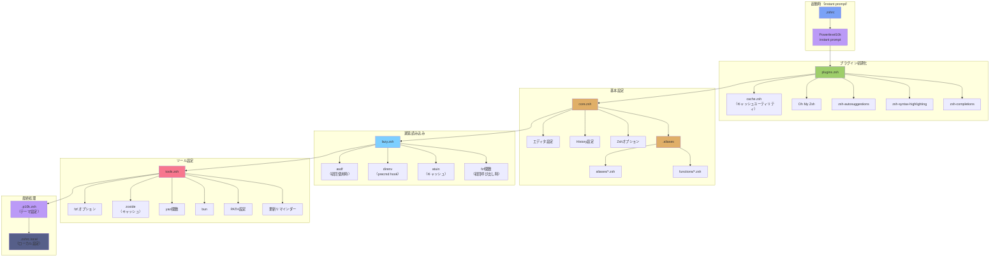
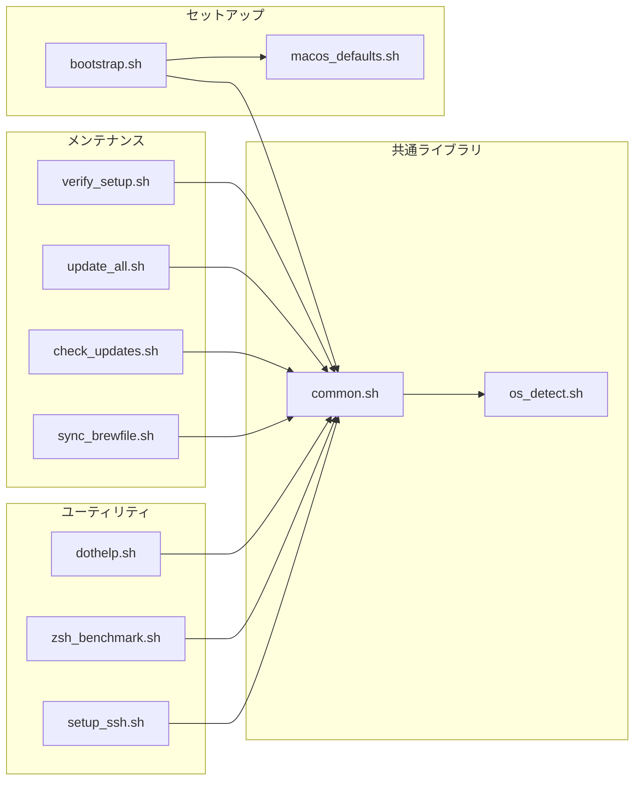
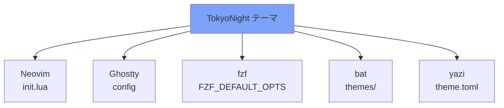
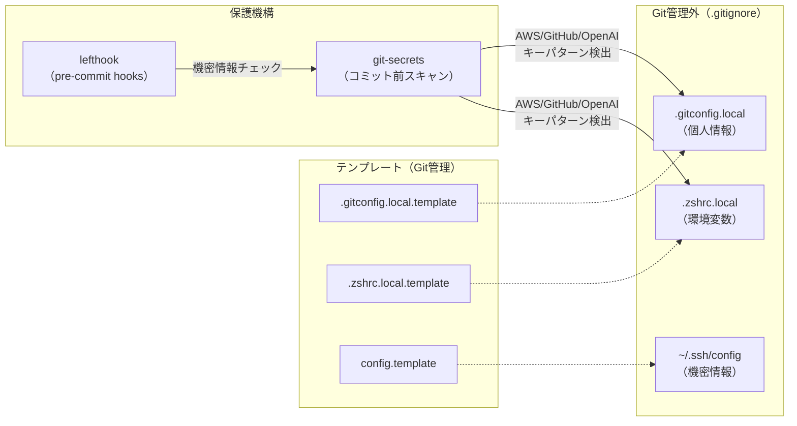

# アーキテクチャ

dotfilesの構造と依存関係を図示します。

## ディレクトリ構造

```
dotfiles/
├── bootstrap.sh           # エントリーポイント（初回セットアップ）
├── Makefile               # Stow操作インターフェース
├── Brewfile               # パッケージ定義
│
├── stow/                  # GNU Stowパッケージ群
│   ├── zsh/               # シェル設定（メイン）
│   ├── git/               # Git設定
│   ├── nvim/              # Neovim設定
│   ├── ghostty/           # ターミナル設定
│   ├── bat/               # bat設定
│   ├── atuin/             # シェル履歴設定
│   ├── yazi/              # ファイルマネージャー設定
│   ├── claude/            # Claude Code設定
│   ├── gh/                # GitHub CLI設定
│   ├── ssh/               # SSH設定（テンプレート）
│   └── antigravity/       # エディタ設定（非Stow）
│
├── scripts/               # ユーティリティスクリプト
│   ├── lib/               # 共通ライブラリ
│   ├── setup/             # セットアップスクリプト
│   ├── maintenance/       # メンテナンススクリプト
│   └── utils/             # ヘルパースクリプト
│
└── docs/                  # ドキュメント
```

## Zsh 読み込みフロー



## スクリプト依存関係



## Stow パッケージ構成

| パッケージ | 管理方式 | 理由 |
|-----------|---------|------|
| zsh | Stow | 標準的なホームディレクトリ配置 |
| git | Stow | 標準的なホームディレクトリ配置 |
| nvim | Stow | XDG準拠（~/.config/nvim） |
| ghostty | Stow | XDG準拠（~/.config/ghostty） |
| bat | Stow | XDG準拠（~/.config/bat） |
| atuin | Stow | XDG準拠（~/.config/atuin） |
| yazi | Stow | XDG準拠（~/.config/yazi） |
| claude | Stow | ~/.claude/ ディレクトリ |
| gh | Stow | XDG準拠（~/.config/gh） |
| ssh | **テンプレート** | 機密情報を含む可能性があるため |
| antigravity | **手動リンク** | macOS固有パス（~/Library/Application Support/） |

## テーマ統一（TokyoNight）



## キャッシュ戦略

| 対象 | キャッシュ場所 | TTL | 更新トリガー |
|------|---------------|-----|-------------|
| zsh-plugin-cache | ~/.cache/ | 7日 | 手動 or TTL超過 |
| atuin-init.zsh | ~/.cache/ | 7日 | TTL超過 |
| zoxide-init.zsh | ~/.cache/ | 7日 | TTL超過 |
| zcompdump | ~/.cache/ | 24時間 | TTL超過 |
| dotfiles-reminder | ~/.cache/ | 7日 | TTL超過 |

## セキュリティ設計


