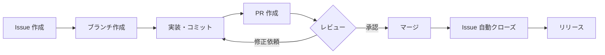

# GitHub プロジェクト管理ガイド

GitHub を使ったプロジェクト管理の基礎から実践までをまとめたガイド。
「小さく始めて段階的に広げる」順序で構成している。

**前提:**
- `gh` CLI がインストール済み（`brew install gh`）
- Conventional Commits を採用（[environment.md](../stow/claude/.claude/environment.md) 参照）

---

## 目次

1. [Issues - すべての起点](#1-issues---すべての起点)
2. [Labels & Milestones - 整理の仕組み](#2-labels--milestones---整理の仕組み)
3. [ブランチ戦略](#3-ブランチ戦略)
4. [Pull Requests - レビューとマージ](#4-pull-requests---レビューとマージ)
5. [GitHub Projects (v2) - 全体俯瞰](#5-github-projects-v2---全体俯瞰)
6. [GitHub Actions - 自動化](#6-github-actions---自動化)
7. [Releases - バージョン管理](#7-releases---バージョン管理)
8. [実践ワークフロー - すべてをつなげる](#8-実践ワークフロー---すべてをつなげる)
9. [参考リンク](#9-参考リンク)

---

## 1. Issues - すべての起点

すべての作業は Issue から始まる。「何をやるか」を明文化し、追跡可能にする。

### 基本操作

```bash
# Issue 作成
gh issue create --title "ログイン機能を追加" --body "OAuth対応のログイン画面"

# ラベル・アサイン付きで作成
gh issue create --title "バグ: 404エラー" --label "bug,priority:high" --assignee "@me"

# 一覧表示
gh issue list                          # オープンな Issue 一覧
gh issue list --state closed           # クローズ済み
gh issue list --label "bug"            # ラベルでフィルタ
gh issue list --assignee "@me"         # 自分にアサインされたもの

# 詳細表示・クローズ
gh issue view 42                       # Issue #42 の詳細
gh issue close 42                      # クローズ
gh issue reopen 42                     # 再オープン
```

### Issue テンプレート

`.github/ISSUE_TEMPLATE/` にテンプレートを配置すると、Issue 作成時に自動適用される。

```
.github/ISSUE_TEMPLATE/
├── bug_report.md          # バグ報告
├── feature_request.md     # 機能要望
└── config.yml             # テンプレート選択画面の設定
```

**バグ報告テンプレート例:**

```markdown
---
name: バグ報告
about: バグの報告
labels: bug
---

## 現象
<!-- 何が起きたか -->

## 再現手順
1.
2.
3.

## 期待される動作
<!-- 本来どうなるべきか -->

## 環境
- OS:
- バージョン:
```

---

## 2. Labels & Milestones - 整理の仕組み

### ラベル設計

3軸（type / priority / status）で整理する:

| カテゴリ | ラベル | 色 | 用途 |
|---------|--------|-----|------|
| **type** | `bug` | `#d73a4a` | バグ修正 |
| | `feature` | `#0075ca` | 新機能 |
| | `docs` | `#0e8a16` | ドキュメント |
| | `refactor` | `#e4e669` | リファクタリング |
| | `chore` | `#cccccc` | メンテナンス作業 |
| **priority** | `priority:high` | `#b60205` | 最優先 |
| | `priority:medium` | `#fbca04` | 通常 |
| | `priority:low` | `#c5def5` | 余裕があれば |
| **status** | `wontfix` | `#ffffff` | 対応しない |
| | `duplicate` | `#cfd3d7` | 重複 |
| | `help wanted` | `#008672` | 協力募集 |

```bash
# ラベル作成
gh label create "priority:high" --color "b60205" --description "最優先で対応"
gh label create "priority:medium" --color "fbca04" --description "通常優先度"
gh label create "priority:low" --color "c5def5" --description "余裕があれば"

# ラベル一覧
gh label list
```

### マイルストーン

期限付きのゴールを設定し、Issue をグループ化する。

```bash
# マイルストーン作成
gh api repos/{owner}/{repo}/milestones -f title="v1.0" -f due_on="2026-04-01T00:00:00Z" -f description="初回リリース"

# Issue にマイルストーンを設定
gh issue edit 42 --milestone "v1.0"

# マイルストーン一覧
gh api repos/{owner}/{repo}/milestones --jq '.[] | "\(.title): \(.open_issues) open / \(.closed_issues) closed"'
```

---

## 3. ブランチ戦略

### GitHub Flow vs git-flow

| 項目 | GitHub Flow（推奨） | git-flow |
|------|-------------------|----------|
| **向いている** | 個人開発、小規模チーム | 大規模チーム、リリースサイクルが決まっている |
| **ブランチ数** | main + feature | main, develop, feature, release, hotfix |
| **複雑さ** | シンプル | 高い |
| **デプロイ** | main = 常にデプロイ可能 | release ブランチ経由 |
| **学習コスト** | 低い | 高い |

**個人開発では GitHub Flow を推奨。** git-flow はチーム開発でリリース管理が必要な場合に使う。

### ブランチ命名規則

Issue 番号を含めることで、ブランチと Issue を紐付ける:

```
feature/42-add-login        # 機能追加（Issue #42）
fix/58-null-pointer         # バグ修正（Issue #58）
docs/71-update-readme       # ドキュメント更新（Issue #71）
refactor/90-extract-utils   # リファクタリング（Issue #90）
```

```bash
# ブランチ作成（Issue ページから直接も可能）
git switch -c feature/42-add-login

# リモートにプッシュ
git push -u origin feature/42-add-login
```

---

## 4. Pull Requests - レビューとマージ

### PR 作成

```bash
# 基本的な PR 作成
gh pr create --title "feat: ログイン機能を追加" --body "Closes #42"

# ドラフト PR（作業中を明示）
gh pr create --draft --title "WIP: ログイン機能" --body "Closes #42"

# レビュアー指定
gh pr create --title "feat: ログイン機能" --reviewer username --body "Closes #42"
```

### Issue との紐付け

PR の本文に以下のキーワードを含めると、マージ時に Issue が自動クローズされる:

| キーワード | 例 |
|-----------|-----|
| `Closes` | `Closes #42` |
| `Fixes` | `Fixes #42` |
| `Resolves` | `Resolves #42` |

複数の Issue を閉じる場合: `Closes #42, Closes #43`

### PR テンプレート

このリポジトリでは [`.github/PULL_REQUEST_TEMPLATE.md`](../.github/PULL_REQUEST_TEMPLATE.md) を使用している。
PR 作成時に自動で本文に反映される。

### PR の管理

```bash
# PR 一覧
gh pr list

# PR の詳細・差分確認
gh pr view 10
gh pr diff 10

# PR のマージ
gh pr merge 10 --squash            # Squash merge（推奨）
gh pr merge 10 --merge             # Merge commit

# レビューコメント確認
gh api repos/{owner}/{repo}/pulls/10/comments
```

### マージ戦略

| 方式 | 特徴 | 向いている場面 |
|------|------|--------------|
| **Squash merge**（推奨） | 複数コミットを1つにまとめる | feature ブランチのマージ。履歴がクリーンになる |
| **Merge commit** | マージコミットを作成 | コミット履歴を残したい場合 |
| **Rebase merge** | ベースブランチに直列化 | 線形な履歴を保ちたい場合 |

---

## 5. GitHub Projects (v2) - 全体俯瞰

> **Note:** 個人プロジェクトでは必須ではない。Issue とラベルだけで十分管理できる場合はスキップしてよい。

### ビューの種類

| ビュー | 用途 |
|--------|------|
| **Board** | カンバン形式。Todo → In Progress → Done の流れを可視化 |
| **Table** | スプレッドシート形式。フィルタ・ソートで一覧管理 |
| **Roadmap** | タイムライン形式。マイルストーン・期限を俯瞰 |

### カスタムフィールド

| フィールド | 型 | 値の例 |
|-----------|-----|--------|
| Status | Single select | Todo, In Progress, In Review, Done |
| Priority | Single select | High, Medium, Low |
| Sprint | Iteration | Week 1, Week 2, ... |

```bash
# プロジェクト一覧
gh project list

# プロジェクトに Issue を追加
gh project item-add PROJECT_NUMBER --owner "@me" --url "ISSUE_URL"
```

---

## 6. GitHub Actions - 自動化

### 基本概念

```
ワークフロー (.yml)
  └── ジョブ (runs-on)
       └── ステップ (uses / run)
```

- **ワークフロー**: `.github/workflows/` に配置する YAML ファイル
- **ジョブ**: 実行環境（`ubuntu-latest` 等）上で動く処理の単位
- **ステップ**: ジョブ内の個別の処理（アクション実行 or コマンド実行）

### 既存ワークフロー

このリポジトリには以下のワークフローがある:

| ファイル | 用途 |
|---------|------|
| [`.github/workflows/ci.yml`](../.github/workflows/ci.yml) | CI（lint 等） |
| [`.github/workflows/claude-learning.yml`](../.github/workflows/claude-learning.yml) | Claude 学習内容の自動記録 |

### コピペ可能なレシピ

**1. PR の自動ラベル付け**

```yaml
# .github/workflows/auto-label.yml
name: Auto Label
on:
  pull_request:
    types: [opened]

jobs:
  label:
    runs-on: ubuntu-latest
    steps:
      - uses: actions/labeler@v5
        with:
          repo-token: "${{ secrets.GITHUB_TOKEN }}"
```

**2. 放置 Issue の自動クローズ（Stale）**

```yaml
# .github/workflows/stale.yml
name: Stale Issues
on:
  schedule:
    - cron: '0 0 * * 1'  # 毎週月曜

jobs:
  stale:
    runs-on: ubuntu-latest
    steps:
      - uses: actions/stale@v9
        with:
          stale-issue-message: '30日間更新がないため stale としてマークします'
          stale-issue-label: 'stale'
          days-before-stale: 30
          days-before-close: 7
```

**3. Release Drafter（リリースノート自動生成）**

```yaml
# .github/workflows/release-drafter.yml
name: Release Drafter
on:
  push:
    branches: [main, master]

jobs:
  draft:
    runs-on: ubuntu-latest
    steps:
      - uses: release-drafter/release-drafter@v6
        env:
          GITHUB_TOKEN: ${{ secrets.GITHUB_TOKEN }}
```

---

## 7. Releases - バージョン管理

### SemVer（セマンティックバージョニング）

```
MAJOR.MINOR.PATCH
  │     │     └── バグ修正（後方互換あり）
  │     └──────── 機能追加（後方互換あり）
  └────────────── 破壊的変更（後方互換なし）
```

| バージョン例 | 意味 |
|-------------|------|
| `0.1.0` | 初期開発 |
| `1.0.0` | 最初の安定版リリース |
| `1.1.0` | 機能追加 |
| `1.1.1` | バグ修正 |
| `2.0.0` | 破壊的変更を含むリリース |

### リリース作成

```bash
# タグを打ってリリース作成
gh release create v1.0.0 --title "v1.0.0" --notes "初回リリース"

# 自動生成されたリリースノート付き
gh release create v1.1.0 --generate-notes

# ドラフトリリース（公開前に確認）
gh release create v1.1.0 --draft --generate-notes

# リリース一覧
gh release list
```

### CHANGELOG の書き方

[Keep a Changelog](https://keepachangelog.com/ja/) 形式を推奨:

```markdown
# Changelog

## [1.1.0] - 2026-03-15

### Added
- ログイン機能を追加 (#42)

### Fixed
- 404 エラーを修正 (#58)

## [1.0.0] - 2026-03-01

### Added
- 初回リリース
```

---

## 8. 実践ワークフロー - すべてをつなげる

### Issue-Driven Development の全体フロー



### 1日の開発サイクル例

```bash
# 1. 今日やることを決める（Issue を確認）
gh issue list --assignee "@me" --label "priority:high"

# 2. Issue を選んでブランチ作成
git switch -c feature/42-add-login

# 3. 実装・コミット（Conventional Commits）
git add -A && git commit -m "feat: ログイン画面のUIを実装"

# 4. PR 作成
gh pr create --title "feat: ログイン機能を追加" --body "Closes #42"

# 5. レビュー後にマージ
gh pr merge --squash

# 6. ブランチ削除・main に戻る
git switch main && git pull
```

### プロジェクト開始時チェックリスト

- [ ] リポジトリ作成（`gh repo create`）
- [ ] ラベルセットを作成（type / priority）
- [ ] Issue テンプレートを配置（`.github/ISSUE_TEMPLATE/`）
- [ ] PR テンプレートを配置（`.github/PULL_REQUEST_TEMPLATE.md`）
- [ ] CI ワークフローを作成（`.github/workflows/ci.yml`）
- [ ] ブランチ保護ルールを設定（Settings → Branches）
- [ ] 最初の Issue を作成して開発開始

---

## 9. 参考リンク

| リソース | 説明 |
|---------|------|
| [GitHub Flow](https://docs.github.com/ja/get-started/using-github/github-flow) | GitHub 公式のブランチ戦略ガイド |
| [GitHub Issues](https://docs.github.com/ja/issues) | Issues の公式ドキュメント |
| [GitHub Projects](https://docs.github.com/ja/issues/planning-and-tracking-with-projects) | Projects v2 の公式ドキュメント |
| [GitHub Actions](https://docs.github.com/ja/actions) | Actions の公式ドキュメント |
| [Conventional Commits](https://www.conventionalcommits.org/ja/) | コミットメッセージ規約 |
| [SemVer](https://semver.org/lang/ja/) | セマンティックバージョニング仕様 |
| [Keep a Changelog](https://keepachangelog.com/ja/) | CHANGELOG のフォーマット |
| [gh CLI マニュアル](https://cli.github.com/manual/) | GitHub CLI リファレンス |
