# Examples

生成済みサンプルは文章と値がダミー。公開時は実際の内容、データ、出典へ差し替える。

## 記事構成

| Cover | Definition | Before / After |
|---|---|---|
| 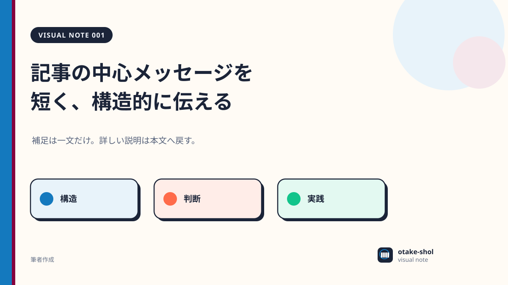 | 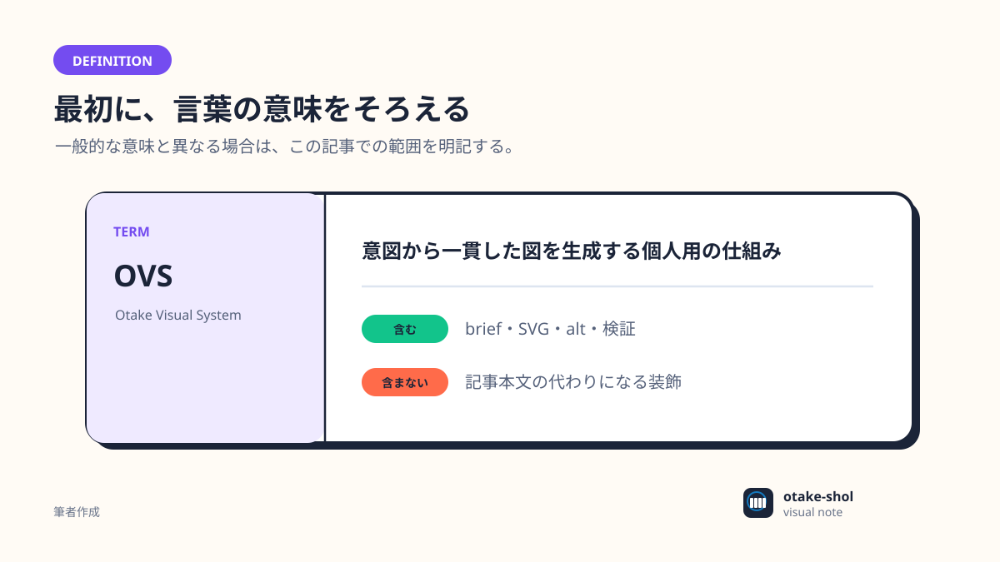 | 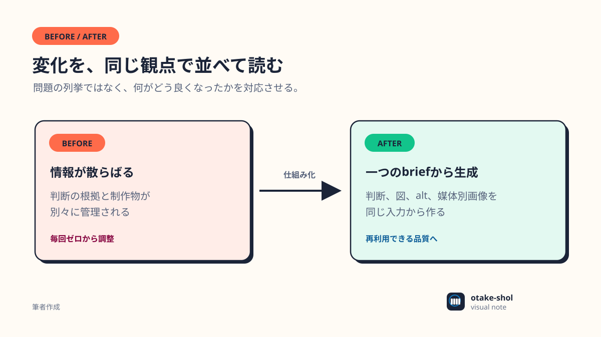 |

| Timeline | Architecture | Sequence |
|---|---|---|
| 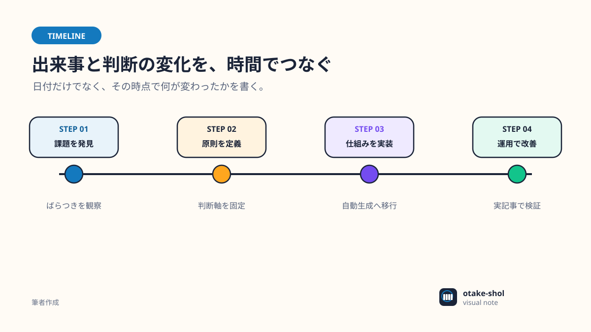 | 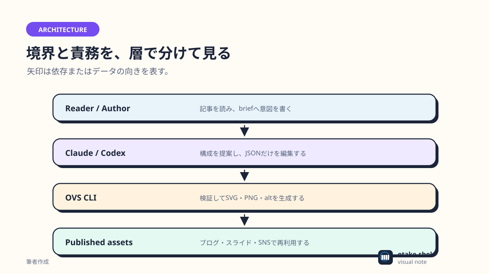 | 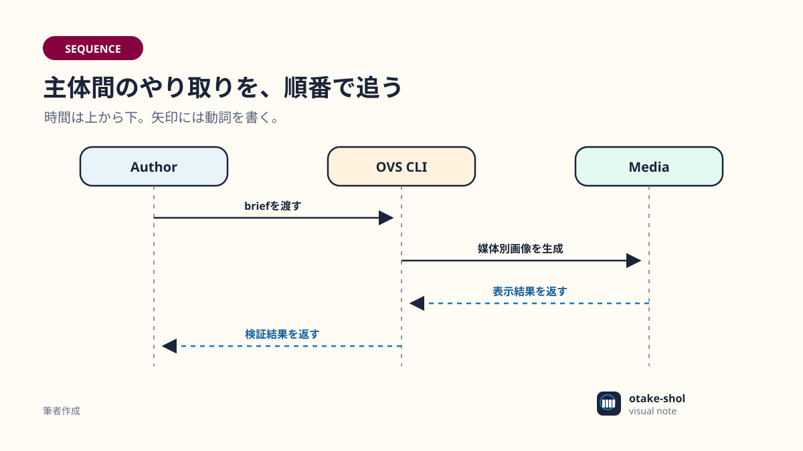 |

## 関係と判断

| Flow | Comparison | Matrix |
|---|---|---|
| 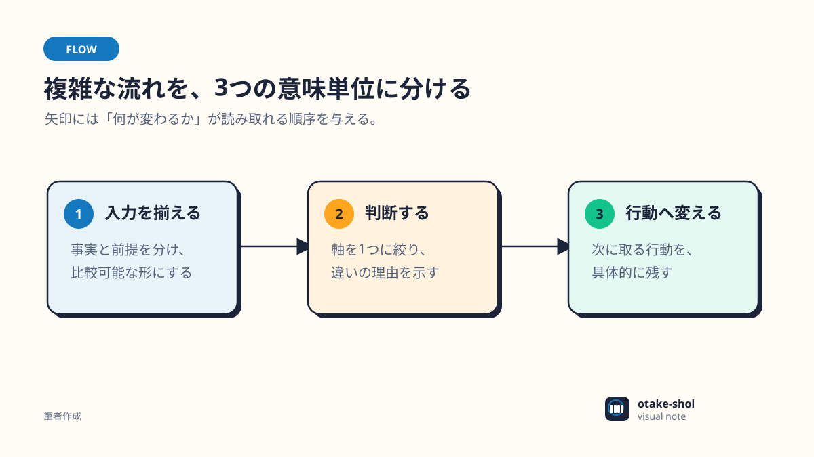 | 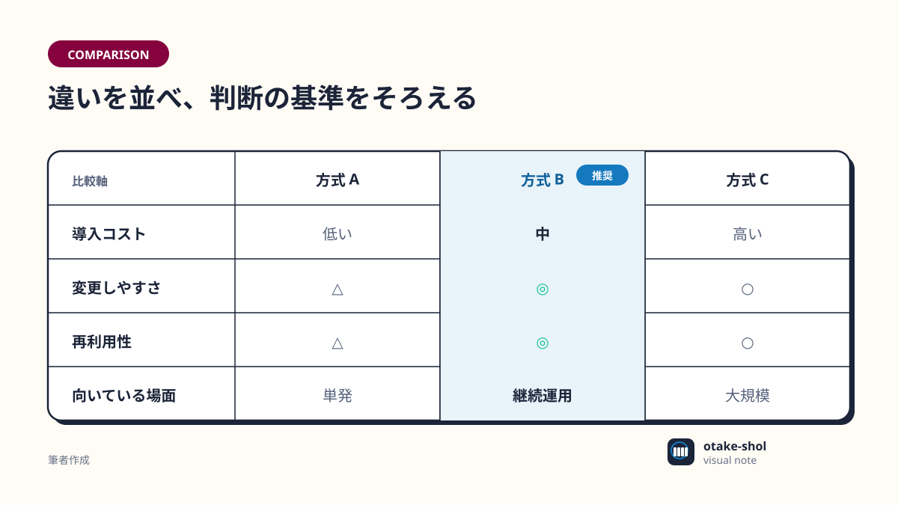 | 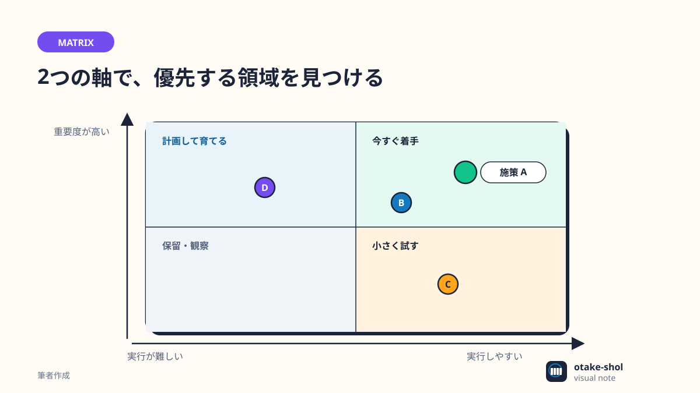 |

## データと強調

| Chart | Takeaway | Warning |
|---|---|---|
| 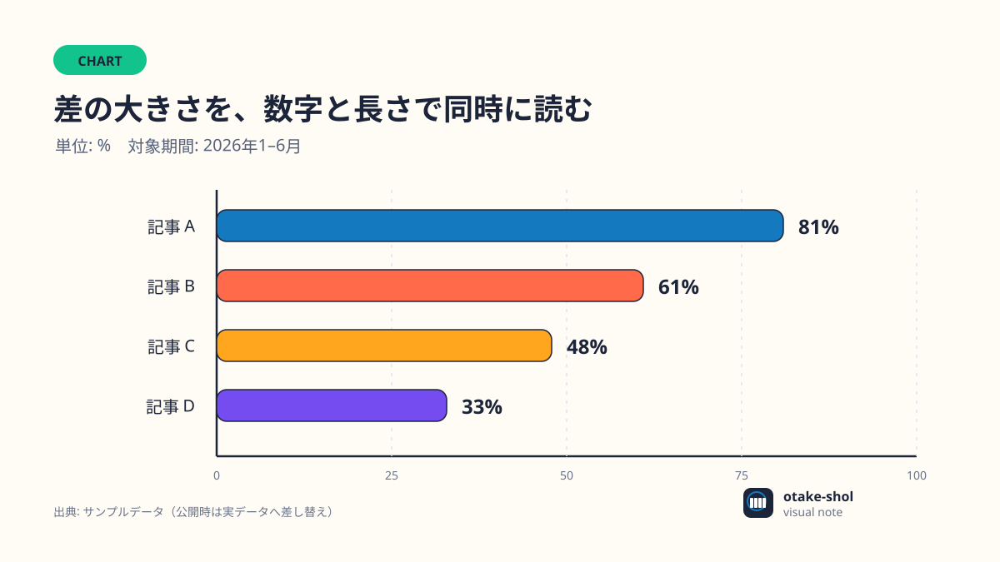 | 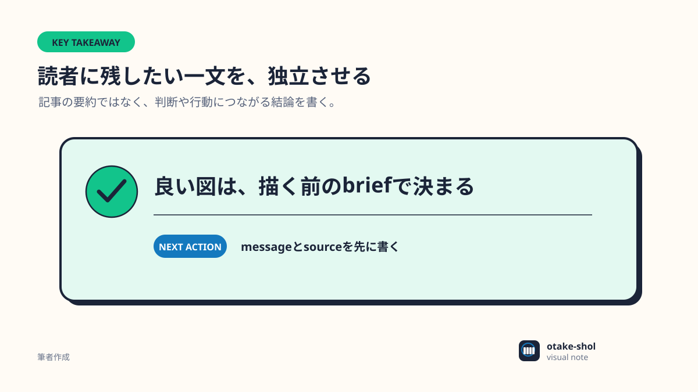 | 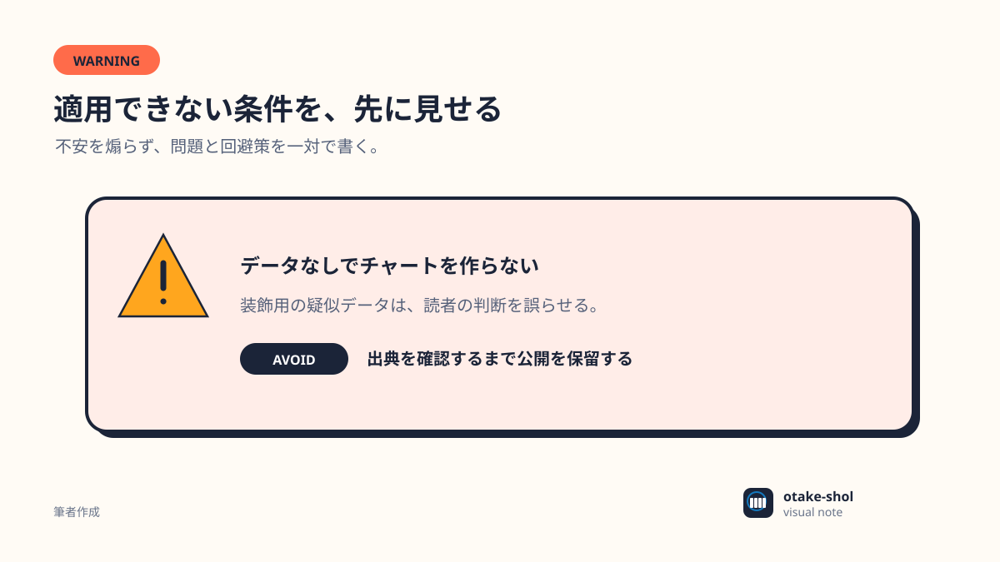 |

## プロジェクトマネジメント

| Gantt | Roadmap | WBS |
|---|---|---|
| 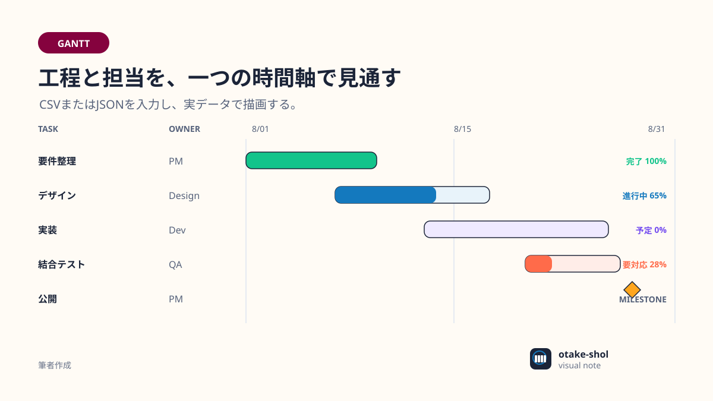 | 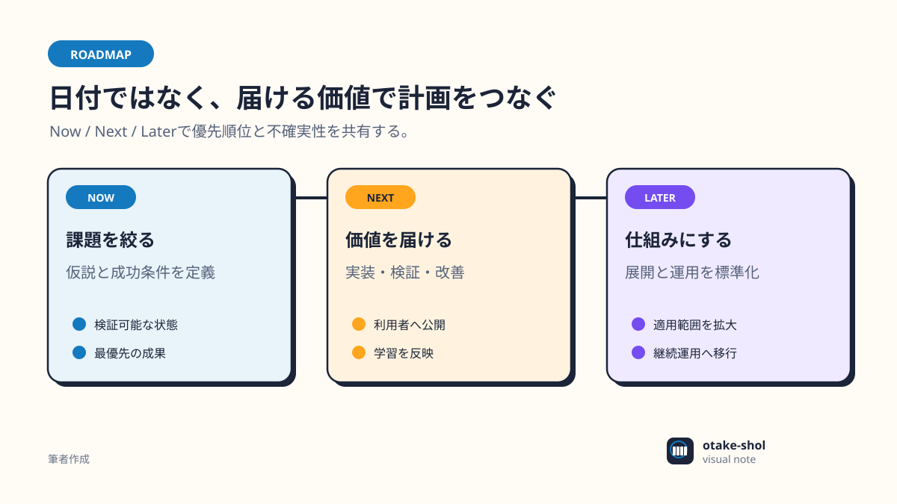 | 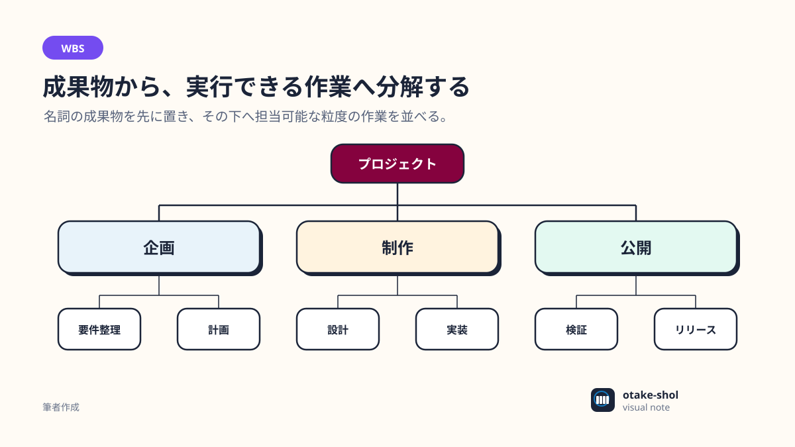 |

| RACI | RAID | Weekly Status |
|---|---|---|
| 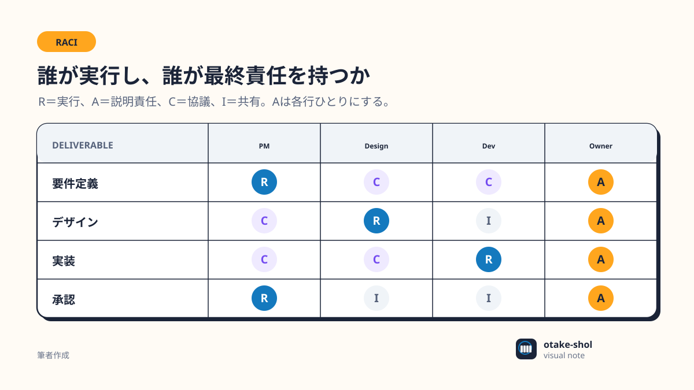 | 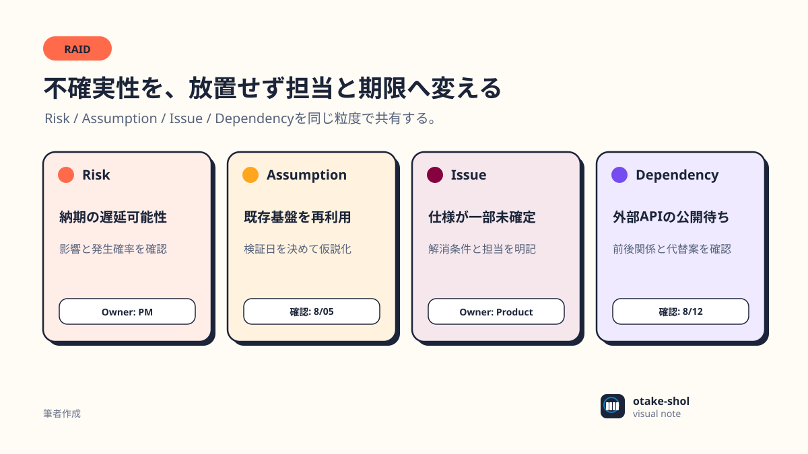 | 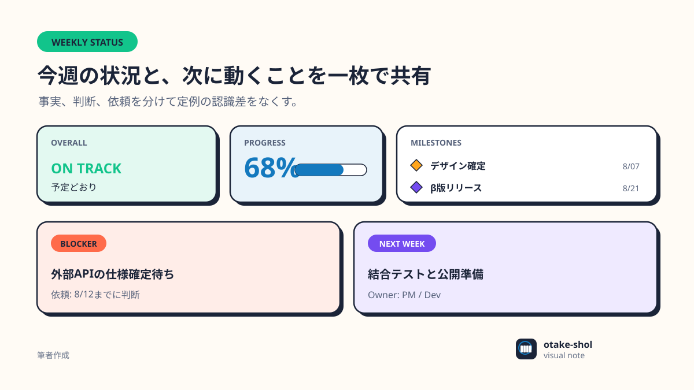 |

## ブラウザで一覧

```bash
ovs preview generated/templates --out generated/gallery.html --force
open generated/gallery.html
```

チャート入力例:

- [`examples/chart.brief.json`](./examples/chart.brief.json)
- [`examples/data/bar.csv`](./examples/data/bar.csv)
- [`examples/data/multi-series.csv`](./examples/data/multi-series.csv)
- [`examples/data/scatter.csv`](./examples/data/scatter.csv)
- [`examples/gantt.brief.json`](./examples/gantt.brief.json)
- [`examples/data/gantt.csv`](./examples/data/gantt.csv)

記事提案例は[`examples/article.md`](./examples/article.md)、Marpテーマ例は
[`examples/slide.md`](./examples/slide.md)。

## レビュー観点

- 18種類を並べても同じ作者の図に見えるか
- 鍵盤マーカーが主張しすぎていないか
- 320px幅でも見出しと主要値が読めるか
- 意味色の役割が図をまたいで変わっていないか
- 色を外しても線、位置、ラベルで関係を追えるか
- `shindanshi-app`と`my-portfolio`の延長に見えつつ、どちらかのコピーになっていないか
