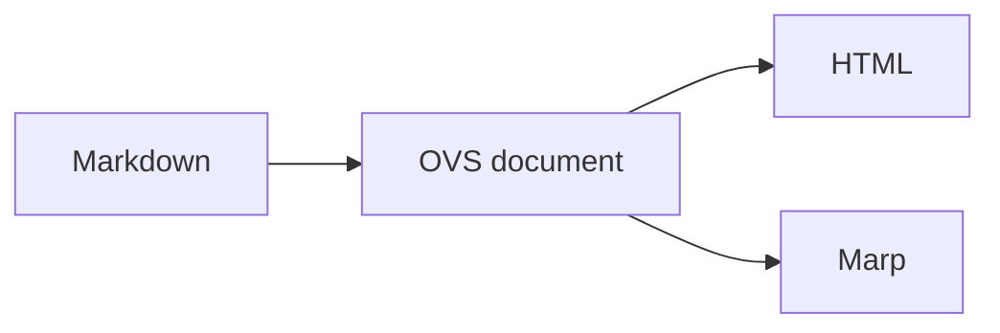

# Otake Visual System

記事、スライド、OGP、SNSの図解を「otake-sholの図」と分かる品質で、
MarkdownまたはJSONから繰り返し生成する個人デザインシステム。

Version 1.1.0 · Visual concept: **Warm Technical Pop**

## 最短の使い方

```bash
make install-design
exec zsh

ovs new design-system-article --part cover
ovs suggest design-system-article/article.md
ovs render design-system-article/design-system-article.brief.json
ovs preview design-system-article/dist
```

`ovs render`はSVG、PNG、同名の`.alt.txt`を一度に作る。編集するのはJSON brief。
生成済みSVGは直接編集しない。

## 用意されているもの

| 種類 | 内容 |
|---|---|
| 図解パーツ | 18種。基本12種 + Gantt、Roadmap、WBS、RACI、RAID、Status Board |
| チャート | 10種。bar、line、stacked-bar、dot、slope、scatter、heatmap、waterfall、small-multiples、progress |
| アイコン | 26種。基本20種 + マイルストーン、成果物、依存関係、スコープ、リソース、課題 |
| レシピ | 技術解説、比較・選定、データストーリー、振り返り、プロジェクト計画、週次ステータス |
| 出力先 | blog、Hatena、OGP、X、正方形、縦長、スライド、サムネイル |
| AI連携 | Claude `/visual`、Codex `$otake-visual` |
| スライド | OVSトークンから生成するMarpテーマ |
| ドキュメント | Markdown内のMermaidを共通SVGへ変換し、HTMLとMarpへ出力 |

パーツの判断基準は[PARTS.md](./PARTS.md)、見本は[EXAMPLES.md](./EXAMPLES.md)。

## 記事から作る

### 1. 図の候補を出す

```bash
ovs suggest examples/article.md
ovs list recipes
```

候補は見出しと語彙による初期案。すべて採用せず、文章だけでは関係が伝わりにくい箇所へ絞る。

### 2. briefを書く

```bash
cp templates/brief.json topic.brief.json
```

最低限決めるもの:

- `intent.message`: 図だけを見た読者に残す一文
- `meta.part`: 伝える関係に合うパーツ
- `content`: 短いタイトルとスロット
- `source`: 出典。自作は「筆者作成」
- `accessibility.alt`: 結論と関係が分かる12〜300文字
- `output`: 媒体と形式

スキーマは`schemas/brief.schema.json`。

### 3. 生成して確認する

```bash
ovs render topic.brief.json --out assets
ovs lint assets
ovs preview assets --out assets/gallery.html
```

同名ファイルがある場合は安全のため停止する。内容を確認して更新する場合だけ
`--force`を付ける。シンボリックリンクは`--force`でも上書きしない。

## データからチャートを作る

CSV:

```csv
category,value
記事 A,81
記事 B,61
```

生成:

```bash
ovs chart data.csv \
  --type bar \
  --title "記事別の読了率" \
  --unit "%" \
  --period "2026年1–6月" \
  --source "アクセス解析" \
  --alt "記事Aが81%で最も高く、記事Bが61%で続く横棒グラフ。" \
  --target blog,ogp \
  --out assets
```

装飾用の疑似データは使わない。`slope`は`start,end`、`scatter`は`x,y`、
複数系列は`series,category,value`を使う。

## プロジェクトマネジメント図を作る

ガントはタスクCSVまたはJSONから直接生成する。日本語の状態
`未着手`、`進行中`、`遅延`、`完了`も利用できる。

```csv
id,task,start,end,owner,status,progress,dependsOn,milestone
design,設計,2026-08-01,2026-08-07,Design,完了,100,,false
build,実装,2026-08-08,2026-08-21,Dev,進行中,45,design,false
release,公開,2026-08-22,2026-08-22,PM,未着手,0,build,true
```

```bash
ovs gantt tasks.csv \
  --id release-plan \
  --title "新機能リリース計画" \
  --today 2026-08-12 \
  --target blog,slide \
  --out assets
```

`dependsOn`はfinish-to-start依存で、複数指定時に`task-a|task-b`と書く。
後続タスクは依存タスクの終了翌日以降に開始する。循環依存、未知の依存先、
不正な日付、0〜100外の進捗は生成前に拒否する。1枚は8タスクまでとし、
超える場合はフェーズで分割する。`id`は半角小文字・数字・ハイフン、
タスク名は16文字、担当名は12文字以内にする。

```bash
ovs list pm
ovs list recipes
```

WBS、RACI、RAID、週次ステータスは専用パーツを使う。マイルストーンは
`timeline`、バーンダウンは`line`、ステークホルダーマップは`matrix`、
依存関係マップは`architecture`も再利用できる。

## MarkdownとMermaidからHTML・Marpを作る

通常のMarkdownへMermaidコードブロックを書く。図ごとに`accTitle`と
12〜300文字の`accDescr`を指定する。安定したファイル名が必要な場合は
`ovs-id`、図ごとの出典は`ovs-source`コメントを加える。

````markdown
# ドキュメント生成


````

生成:

```bash
ovs document examples/document.md --target html,marp --out dist
```

```text
dist/
├── assets/
│   ├── document-flow.svg
│   └── ovs.css
├── document.html
├── document.marp.md
└── document.marp.html
```

Mermaidは`generated/mermaid.json`、通常HTMLは`generated/html.css`、
Marpは`generated/marp.css`を使う。3つとも`tokens.json`から生成するため、
色とフォントを個別管理しない。Mermaid SVGには`securityLevel: strict`を適用し、
外部参照、スクリプト、`foreignObject`、イベント属性を出力前に拒否する。
Mermaid内のfront matter／設定directiveによるテーマ上書きと、Markdown本文の
危険な生HTML、front matter／MarpコメントからのCSS注入も拒否する。
生HTMLは`abbr`、`br`、`details`、`kbd`、`mark`、`sub`、`summary`、`sup`
だけを許可し、Marp directiveコメント内では生HTMLを許可しない。
実行可能スキームと文字参照を含むMarkdownリンクも拒否する。HTMLコード例は
フェンス付きコードブロックへ入れる。

`--target html`または`--target marp`で片方だけ生成できる。全図に共通の出典は
`--source "筆者作成"`で指定する。既存出力の更新は対象を確認して
`--force`を付ける。Marpは記事を自動でスライド分割しないため、同じMarkdown内へ
`---`の区切りを置き、1スライド1メッセージ・1図を目安にする。

## 媒体別に書き出す

```bash
ovs export visual.svg --target hatena,ogp,x,square,vertical,slide,thumbnail
```

| target | px | 用途 |
|---|---:|---|
| `blog` / `hatena` | 1200 × 675 | 記事本文 |
| `ogp` | 1200 × 630 | OGP |
| `x` | 1600 × 900 | X投稿 |
| `square` | 1080 × 1080 | 正方形SNS |
| `vertical` | 1080 × 1350 | 縦長SNS |
| `slide` | 1280 × 720 | 16:9スライド |
| `thumbnail` | 600 × 338 | 一覧サムネイル |

縦横比が違う媒体は背景を拡張し、図の内容を切らない。compact媒体では補足文を省く。

## 視覚文法

`shindanshi-app`と`my-portfolio`の設計資産を、記事用に統合している。

1. 温かいクリームの紙面と、純黒ではない濃紺
2. 2.5pxの輪郭と、ぼかさない右下オフセットシャドウ
3. Zen Maru Gothicの見出し、Plus Jakarta Sansの数字、可読性優先の本文
4. Recruit Blueを主張、wineを署名、coral/mint/mango/violetを意味色に使う
5. 右下の小さな鍵盤マーカーと`otake-shol / visual note`

参考ブログから継承するのは、同じ視覚文法を反復して作者性を作る考え方だけ。
黒板、チョーク、手描き線など相手固有の表現は模倣しない。

## CLI

```text
ovs new <slug>                 記事とbriefの雛形を作る
ovs suggest <article.md>       パーツと記事レシピを提案
ovs render <brief.json>        SVG・PNG・altを生成
ovs chart <data.csv|json>      実データからチャートを生成
ovs gantt <tasks.csv|json>     タスクからガントを生成
ovs document <file.md>         MermaidをHTML・Marpで共有
ovs export <file.svg>          媒体別サイズへ展開
ovs preview [dir]              HTMLギャラリーを生成
ovs lint <svg|dir>             安全性・構文・altを検証
ovs list <kind>                パーツ等の一覧を表示
```

`render`、`chart`、`gantt`、`document`、`export`、`preview`、`suggest --write`は
既存出力を上書きしない。
再生成は対象を確認して`--force`を付ける。書込みは同じディレクトリ内で原子的に行う。

## 唯一の正と生成物

```text
tokens.json
icons.json
components/*.svg.tpl
templates/*.svg.tpl
themes/marp.css.tpl
themes/html.css.tpl
recipes/*.json
schemas/brief.schema.json
        │
        ├─ scripts/build.mjs
        │    └─ generated/{tokens,templates,icons,html,marp,mermaid,manifest}
        └─ scripts/ovs.mjs
             └─ SVG + PNG + alt + gallery + HTML/Marp document
```

ブランド色とフォントは`tokens.json`以外へ追加しない。アイコンは`icons.json`、
テンプレート構造は`templates/*.svg.tpl`、描画判断はCLIへ集約する。

## 検証

```bash
node scripts/build.mjs
node scripts/build.mjs --check
node --test test/*.test.mjs
make design-check
```

`make design-check`はトークン同期、JSON briefからの18パーツ生成、10チャート、
データ駆動ガント、SVG XML、安全属性、320px描画、Marpテーマを確認する。

公開前の受け入れ基準:

- 1図1メッセージ
- 320px幅でも見出しと主要値が読める
- 色だけに依存せず、線・位置・ラベルでも関係を追える
- 実データに単位、期間、出典がある
- SVG、PNG、altが揃う
- 第三者の固有表現や著作物をトレースしていない

## 安全性

- SVGの`script`、`foreignObject`、外部画像、イベント属性、外部参照を拒否する
- SVG要素・属性を許可リストで検査し、`xmllint --nonet`でもXML構文を確認する
- 個人情報、秘密情報、未公開業務データをbriefへ入れない
- 出典不明のデータは公開しない
- 1枚8ノード、4系列を目安の上限にする
- ラベルが長い場合は図を詰めず、説明を本文へ戻す
