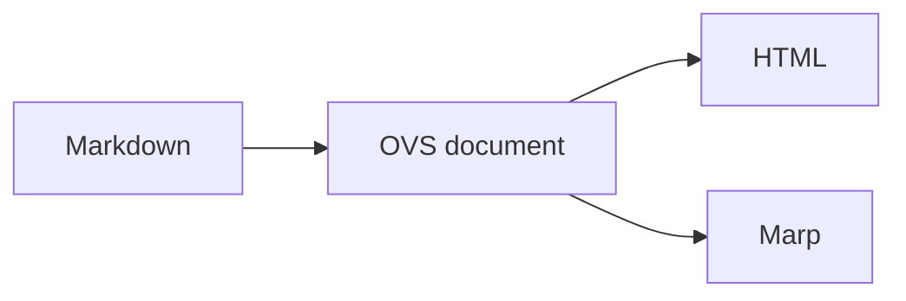

# MarkdownからHTMLとMarpを作る

本文とMermaidを一つのMarkdownで管理し、同じ図を記事とスライドで再利用する。

```mermaid
flowchart LR
  %% ovs-id: ovs-document-flow
  %% ovs-source: 筆者作成
  accTitle: OVSドキュメント生成フロー
  accDescr: Markdown内のMermaidをOVSテーマ付きSVGへ変換し、HTMLとMarpで共有する処理フロー。
  A[Markdown] --> B[OVS document]
  B --> C[HTML]
  B --> D[Marp]
```
